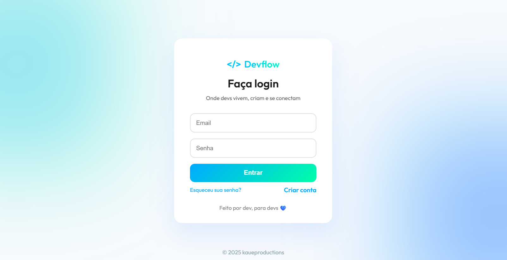
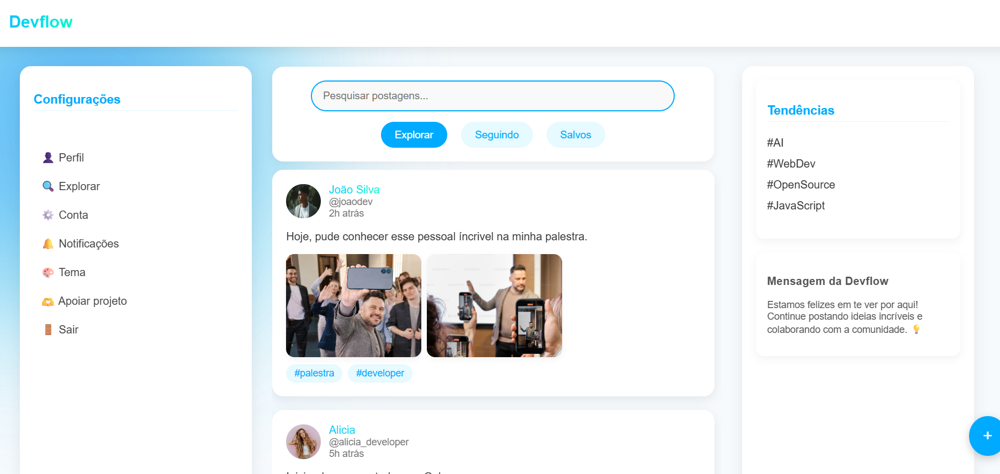

# 🚀 Devflow

Devflow é uma plataforma voltada para a comunidade de desenvolvedores. Aqui, os usuários podem compartilhar e interagir com outros devs.

---

---

## ✨ Visão

Devflow combina postagens rápidas com a profundidade de uma rede voltada á bolha dev. É onde inovação, tecnologia e colaboração se encontram.

## 🔧 Funcionalidades

- 📝 Feed de postagens com:
  - Foto de perfil
  - Nome e @usuário
  - Tempo da postagem
  - Conteúdo + hashtags destacadas
- 🔍 Barra de pesquisa
- ⚙️ Aba de configurações com:
  - Perfil
  - Tema
  - Conta
  - Notificações
  - Explorar
- 📈 Aba de tendências
- 💬 Espaço dedicado para avisos da Devflow
- ➕ Botão fixo para criar postagens
- 👤 Página de perfil com foto, banner e bio

## 🖼️ Estilo e Design

- Tema **clean e elegante**, inspirado em **tecnologia e inovação**
- Interface intuitiva, com animações suaves e layout responsivo

## 📦 Tecnologias Utilizadas

- HTML, CSS, JavaScript
- Backend com Node.js + Express
- Banco de dados
- Armazenamento de imagens via Amazon S3

## 🚧 Em desenvolvimento

Esta é uma versão inicial do Devflow. Novos recursos e melhorias estão em andamento.

##

---

---
